# Client-side features

## Booking process overview

1. **Choose a Service**: Select the type of service you need (e.g., a photography session).
2. **Select Date and Photographer**: Pick an available date and photographer from the calendar view.
3. **Provide Personal Information**: Fill out your details and choose payment options (if applicable).
4. **Confirm Booking**: Review and finalize your appointment.

## Detailed steps

### Service selection
Imagine you're interested in booking, let's say a photography session. The first step isn't about picking a date or
time; it's about choosing the kind of photographic experience you need. This choice matters because it sets the stage
for everything that follows.

After considering the best way for users to start, I decided not to include a generic service selection feature (like a
basic HTML page) within my package. Why? Flexibility and personal touch. Here's a glimpse into
the service page I created for the photography project, which might inspire your setup :
[Live](https://tchiiz.com/services/) :

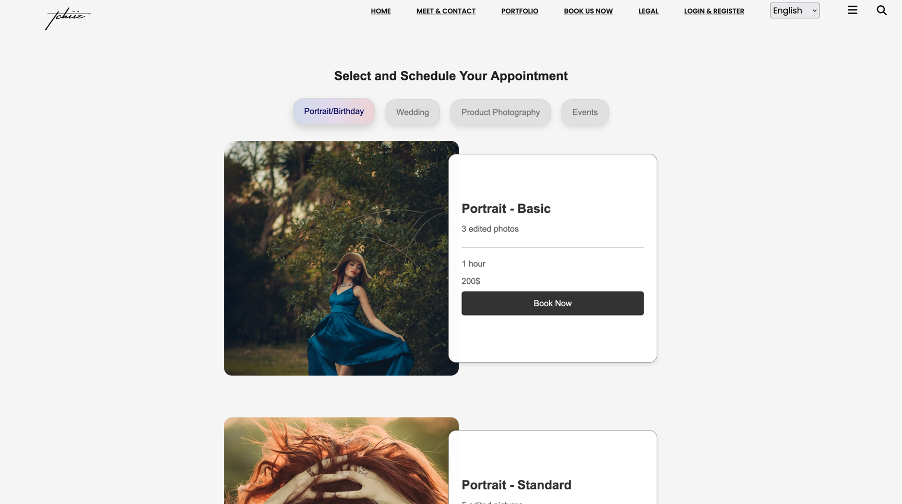

### Date and photographer selection
Once you've made your choice, the next step is to choose an available date and time. That's
where the package takes over for you, providing a calendar view of the current month. The page not only shows dates but
also presents an overview of the chosen service, including its name, the default date (set to today), price, and
duration. And then, there's the list of available photographers—each with their unique style and specialty,
waiting to bring your vision to life.

But why a list? Flexibility. Whether you're engaging with a solo artist or a symphony of talents, the package adapts. If
I have three photographers, each a master of a different style, only those suited to your chosen service appear on the
list. If there's just one, the decision is made simpler—by default, they're chosen.

This is an overview of what is displayed: 

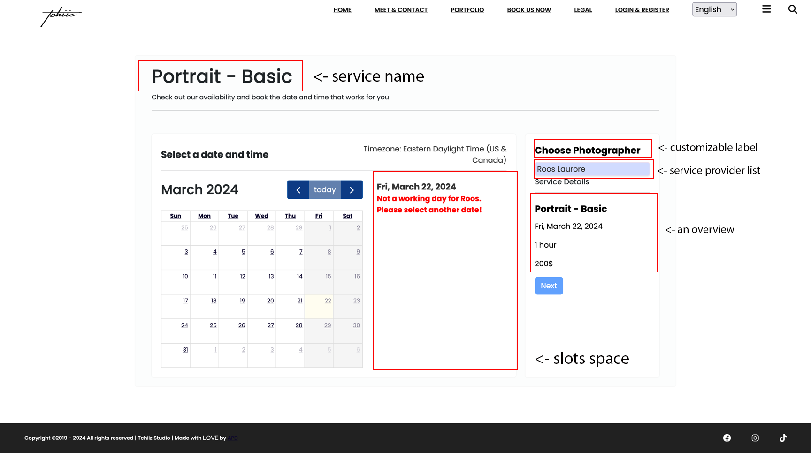

Once a photographer is chosen, their availability is displayed, including days they are not working (making those dates
un-selectable), vacation times (also un-selectable), etc...

Their start and end times (set by the staff member) are used along with the slot duration to determine available booking
slots. This setup is aimed at ensuring that the booking time aligns well with the photographer's schedule.

It would look like this before choosing which person for the chosen service :

!!! note
    The label displayed in the image as "Choose photographer" is fully customizable to suit your project's
    requirements. You have the flexibility to modify it to "Choose developer", "Choose X", or any other designation
    relevant to your service. This aspect ensures the page accurately reflects the nature of your project. For
    illustrative purposes, I will proceed with the context of photography.

#### Availability Display
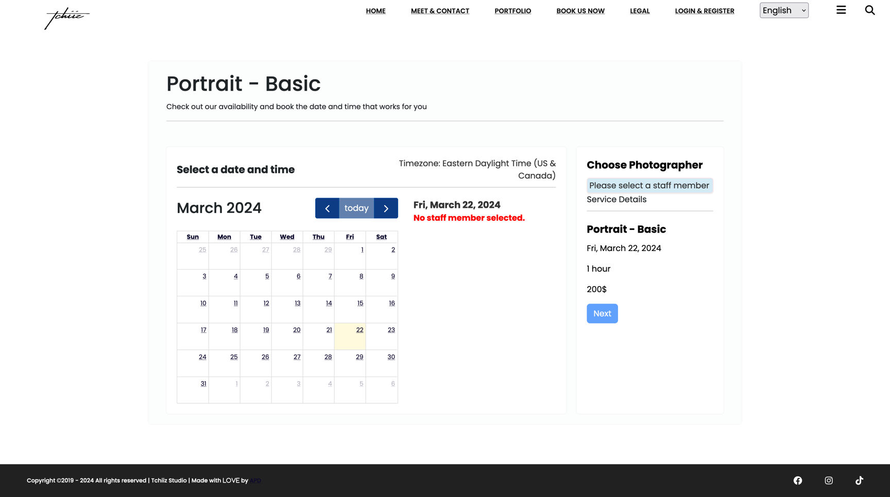

Will show like this with the slots displayed:

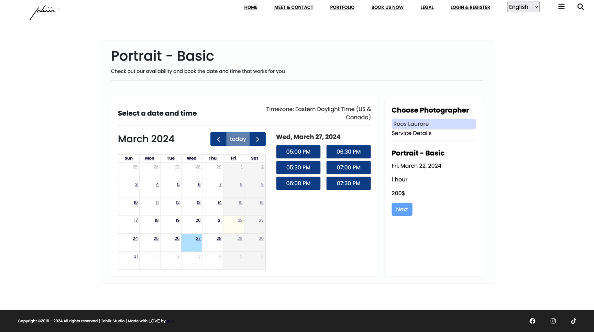

and like this when a slot is selected, there, the next button is no longer grayish, but is clickable:

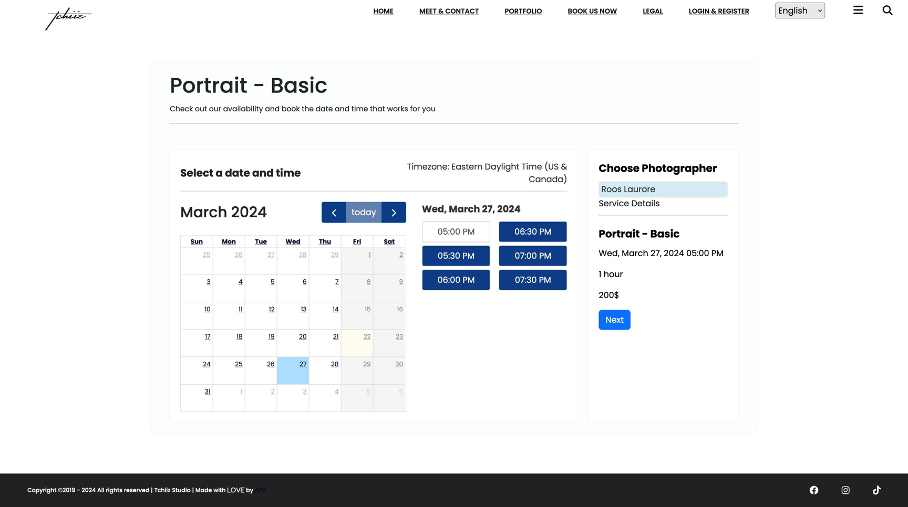

!!! warning
    In the images shown, days highlighted in dark gray represent dates that are not selectable. This
    unavailability is due to the staff member's decision not to work on those days, thus precluding any appointments. For
    instance, in the displayed example, a specific staff member has chosen to start their workday at 5 pm (17:00) and
    conclude at 7:30 pm (19:30), although on other days, their schedule may begin as early as wanted. Importantly, clients
    cannot select past dates for appointments. After a client completes the booking process, the occupied slot(s) are
    immediately removed from the availability list. If, for example, the service duration is one hour with slots proposed
    in 30-minute increments, and an appointment is scheduled at 5 pm (17:00), two slots will be deducted for subsequent
    clients, making the next available start time 6 pm (18:00).

### Personal information and payment options

To finalize the appointment, the client is prompted to click the "Next" button:

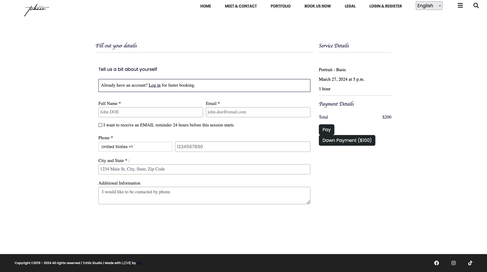

At this stage, clients are required to input their personal information to complete the booking process. The
availability of payment options depends on several factors:

1. If an API gateway link is configured in `settings.py`.
2. Whether the service requires payment.

Based on these conditions:

- The "Pay" and "Down Payment" buttons will be displayed if down payments are accepted for a paid service and an API
  gateway link is provided.
- If down payments are not accepted, the corresponding button will not appear.
- In the absence of an API gateway link, regardless of the service being paid, only a "Finish" button will be shown.
- For free services, even with an API gateway link provided, only a "Finish" button will be displayed.

It will look like this if service is free : 

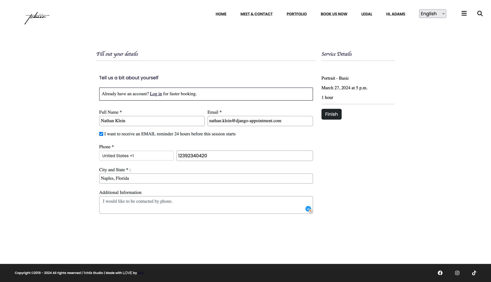

### Verification and confirmation

When the client sends the form, if he/she uses an email address already know by the database, an email is sent with a 
code to verify that it's the same person and that email belongs to him/her.

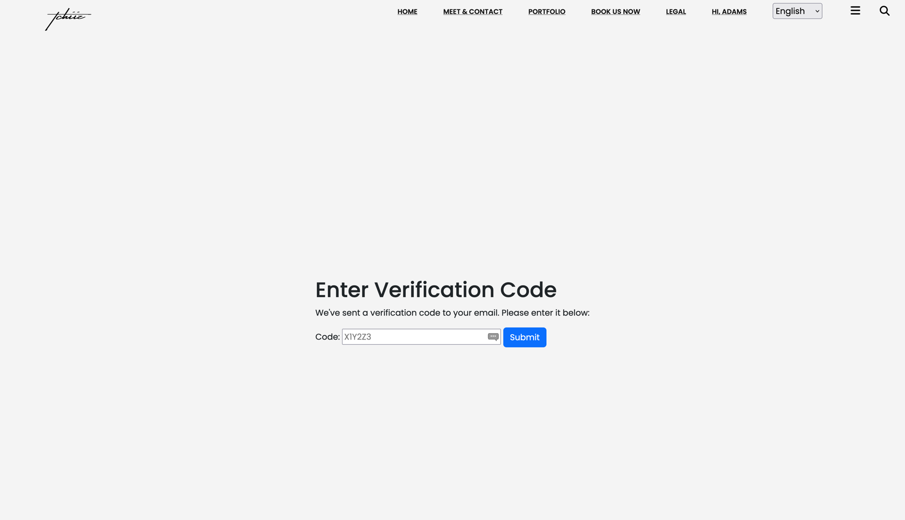

If everything goes well, upon clicking "Finish," a confirmation page is shown with a recap :

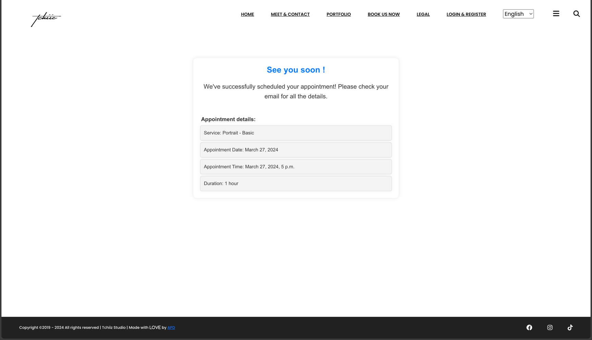

#### Post-booking process

An email is sent to:

1. The staff admin responsible for providing the service.
 
2. The site owner, if specified.
   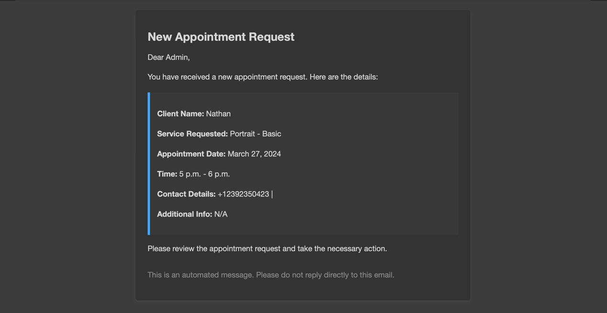

3. The client.
   
   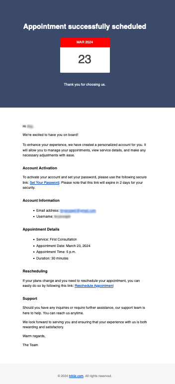

Additionally, if the client opts for a reminder and Django-Q is configured as described in the provided documentation, a
reminder email will be dispatched 24 hours prior to the appointment.

The email received by the client will always include a rescheduling link, allowing them to reschedule the appointment if
this is permitted by the site owner's configuration. However, to prevent abuse, the site administrator has the ability
to set a limit on the number of times a client can reschedule. For example, clients may be restricted to rescheduling no
more than three times.

This concludes the client-side process.
