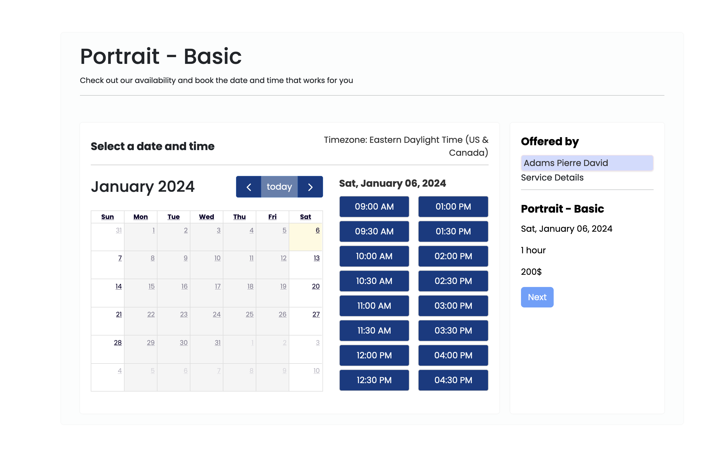
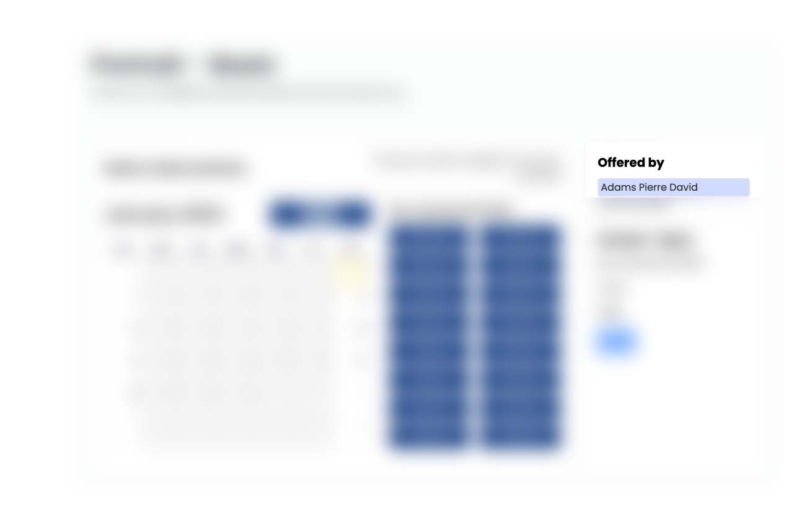

# Models

!!! Note
    All the models have a `created_at` and `updated_at` field. These fields are automatically updated when the
    model is created or updated. They are not editable by the user.

## Service

The `Service` model encapsulates a service provided by the appointment system.

### Service Fields:

- `name` (CharField): The name of the service.
- `description` (TextField): Description of the service.
- `duration` (DurationField): Duration of the service.
- `price` (DecimalField): Price of the service.
- `down_payment` (DecimalField): Down payment for the service.
- `image` (ImageField): Image representing the service.
- `currency` (CharField): Currency for the price.
- `background_color` (CharField): Background color for the service presentation.
- `reschedule_limit` (PositiveIntegerField): Maximum number of reschedule requests allowed for this service.
  Defaults to `0`. Only consulted when `allow_rescheduling` is enabled.
- `allow_rescheduling` (BooleanField): Whether this service uses its own `reschedule_limit` rather than the global
  `Config.default_reschedule_limit`. Defaults to `False`.
- `use_service_duration_as_slot` (BooleanField): When enabled, the service's real duration is used to check slot
  availability, preventing overlaps for services longer than the configured slot step. Defaults to `True`, and is
  only consulted when `default_to_service_duration` is disabled in [Config](#config).

### Service Methods:

- `to_dict`: Returns a dictionary representation of the service.
- `get_duration_parts`: Returns the duration of the service as a tuple of days, hours, minutes, and seconds.
- `get_duration`: Returns the duration of the service in a human-readable format (as a string).
- `get_price`: Returns the price of the service.
- `get_currency_icon`: Returns the currency symbol.
- `get_price_text`: Returns the price formatted for the active language, with the currency symbol where that language
  puts it (`$150` in English, `150 $US` in French), or "Free". Whole amounts have no decimals.
- `get_down_payment`: Returns the down payment amount for the service.
- `get_down_payment_text`: Returns the down payment formatted the same way as `get_price_text`, or "Free".
- `get_image_url`: Returns the URL of the image associated with the service.
- `is_a_paid_service`: Returns whether the service is paid (true of false).
- `accepts_down_payment`: Returns whether the service accepts a down payment (true of false).

## StaffMember

The `StaffMember` model represents a staff member in the appointment system. A staff member is a user that offers
one or more services in the one defined by the admin. He can't edit/add/delete services but can choose which one he
offers. He can update his profile, change his working hours, add vacation days (days off), or block part of a single
day ([unavailabilities](#unavailability)).

### StaffMember Fields:

- `user` (OneToOneField): Related User model instance. Creating a `StaffMember` grants that user Django's `is_staff`
  flag — that is what the [administration views](admin_views.md) check — however the record was created: the
  staff-member form, the Django admin, or a fixture. Superusers are left untouched, since they already pass those
  checks through `is_superuser`.
- `services_offered` (ManyToManyField): Services offered by the staff member.
- `slot_duration` (PositiveIntegerField): Minimum time for an appointment in minutes.
- `lead_time` (TimeField): Time when the staff member starts working.
- `finish_time` (TimeField): Time when the staff member stops working.
- `appointment_buffer_time` (FloatField): Buffer time for the first available slot.
- `slot_gap_time` (PositiveIntegerField): Required rest time in minutes between the end of one appointment and the
  start of the next. Overrides the global [Config](#config) value for this staff member.
- `work_on_saturday` (BooleanField): Whether the staff member works on Saturday.
- `work_on_sunday` (BooleanField): Whether the staff member works on Sunday.

### StaffMember Methods:

- `get_slot_duration`: Returns the slot duration.
- `get_slot_duration_text`: Returns the slot duration in a human-readable format.
- `get_lead_time`: Returns the lead time defined by the staff member first else default one.
- `get_finish_time`: Returns the finish time defined by the staff member first else default one.
- `works_on_both_weekends_day`: Returns whether the staff member works on both weekend days.
- `get_staff_member_name`: Returns the name of the staff member.
- `get_staff_member_first_name`: Returns the first name of the staff member.
- `get_non_working_days`: Returns a list of non-working days.
- `get_weekend_days_worked_text`: Returns a string representation of the weekend days worked.
- `get_services_offered`: Returns the services offered by the staff member.
- `get_service_offered_text`: Returns a string representation of the services offered.
- `get_service_is_offered`: Returns whether the staff member offers the service with the given ID.
- `get_appointment_buffer_time`: Returns the appointment buffer time.
- `get_appointment_buffer_time_text`: Returns the appointment buffer time in a human-readable format.
- `get_days_off`: Returns the days off for the staff member.
- `get_unavailabilities`: Returns every [`Unavailability`](#unavailability) recorded for the staff member.
- `get_unavailabilities_for_date`: Returns the staff member's unavailabilities on one given date.
- `get_working_hours`: Returns the working hours for the staff member.
- `update_upon_working_hours_deletion`: Updates the weekend working status upon deletion of working hours.
- `is_working_day`: Returns whether a given day is a working day (true or false).

## AppointmentRequest

The `AppointmentRequest` model represents an appointment request made by a client. It is not yet an appointment, and it
is not associated with the client. It is created when the client chooses a service, staff member, and date/time for the
appointment (See screenshot below).

It will be linked to an appointment when the client enters their information. We make sure that the start time is before
the end time and on save, we generate an `id_request` if none exists, make sure that the appointment request date is
not in the past.

### AppointmentRequest Fields:

- `date` (DateField): The date of the appointment request.
- `start_time` (TimeField): The starting time of the appointment.
- `end_time` (TimeField): The ending time of the appointment, set automatically by adding service duration.
- `service` (ForeignKey): The service being requested, linking to the `Service` model.
- `staff_member` (ForeignKey): The staff member assigned to the appointment, linking to the `StaffMember` model.
- `payment_type` (CharField): The type of payment for the appointment (e.g., 'full').
- `id_request` (CharField): An ID for the appointment request.
- `reschedule_attempts` (PositiveIntegerField): Counter of reschedules for this request. See the note below — the live reschedule flow does not currently maintain it.

### AppointmentRequest Methods:

- `get_service_name`: Returns the name of the service.
- `get_service_price`: Returns the price of the service.
- `get_service_down_payment`: Returns the down payment amount for the service.
- `get_service_image`: Returns the image of the service.
- `get_service_image_url`: Returns the URL of the service's image.
- `get_service_description`: Returns the description of the service.
- `get_id_request`: Returns the ID of the appointment request.
- `is_a_paid_service`: Returns whether the service is paid.
- `accepts_down_payment`: Returns whether the service accepts a down payment.
- `can_be_rescheduled`: Returns whether `reschedule_attempts` is still below the service's `reschedule_limit`.
- `increment_reschedule_attempts`: Increments the reschedule counter and saves it.
- `get_reschedule_history`: Returns this request's `AppointmentRescheduleHistory` entries, newest first.

!!! warning "`reschedule_attempts` is not wired into the reschedule flow"
    Nothing in the booking or rescheduling views calls `increment_reschedule_attempts`, so `reschedule_attempts`
    stays at `0` and `can_be_rescheduled()` always returns `True` for any service with a non-zero
    `reschedule_limit`. The limit that is actually enforced is computed by `can_appointment_be_rescheduled`, which
    counts reschedule history entries created in the last 5 minutes. Treat these two members as available for your own code rather than as a description of the built-in behaviour.

## AppointmentRescheduleHistory

The `AppointmentRescheduleHistory` model records a rescheduling of an appointment request. One entry is created each time a client asks to move an appointment.

What the `date`, `start_time`, `end_time` and `staff_member` fields hold depends on the entry's status:

- while `pending`, they hold the **requested new** slot;
- once `confirmed`, the appointment request is updated with those values and the history entry is rewritten in place to hold the **previous** slot, so it becomes a record of what the appointment moved away from.

An entry starts out `pending` and becomes `confirmed` once the client follows the confirmation link, which is only valid for 5 minutes. On save, an `id_request` is generated if none exists and the date is validated as not being in the past.

### AppointmentRescheduleHistory Fields:

- `appointment_request` (ForeignKey): The appointment request being rescheduled, related name
  `reschedule_histories`.
- `date` (DateField): The requested date while `pending`; the previous date once `confirmed`.
- `start_time` (TimeField): The requested start time while `pending`; the previous one once `confirmed`.
- `end_time` (TimeField): The requested end time while `pending`; the previous one once `confirmed`.
- `staff_member` (ForeignKey): The requested staff member while `pending`; the previous one once `confirmed`.
- `reason_for_rescheduling` (TextField): The reason the client gave for rescheduling.
- `reschedule_status` (CharField): Either `pending` or `confirmed`. Defaults to `pending`.
- `id_request` (CharField): An ID for the reschedule request, used in the confirmation link.

### AppointmentRescheduleHistory Methods:

- `still_valid`: Returns whether the reschedule request is still confirmable. Entries expire **5 minutes** after
  creation.

## Appointment

The `Appointment` model represents an appointment made by a client. It is created when the client confirms the
appointment request.

### Appointment Fields:

- `client` (ForeignKey): The client who made the appointment, linking to the User model.
- `appointment_request` (OneToOneField): The appointment request that was confirmed.
- `phone` (PhoneNumberField): The client's phone number.
- `address` (CharField): A general address for the client (e.g., city and state).
- `want_reminder` (BooleanField): Indicates if the client wants a reminder.
- `additional_info` (TextField): Any additional information provided by the client.
- `paid` (BooleanField): Indicates if the appointment has been paid for.
- `amount_to_pay` (DecimalField): The amount to be paid for the appointment.
- `id_request` (CharField): An ID for the appointment.

### Appointment Methods:

- `get_client_name`: Returns the full name of the client.
- `get_date`: Returns the date of the appointment.
- `get_start_time`: Returns the starting time of the appointment.
- `get_end_time`: Returns the ending time of the appointment.
- `get_service`: Returns the service associated with the appointment.
- `get_service_name`: Returns the name of the service.
- `get_service_duration`: Returns the duration of the service.
- `get_staff_member_name`: Returns the name of the staff member associated with the appointment.
- `get_staff_member`: Returns the staff member associated with the appointment.
- `get_service_price`: Returns the price of the service.
- `get_service_down_payment`: Returns the down payment amount for the service.
- `get_service_img`: Returns the image of the service.
- `get_service_img_url`: Returns the URL of the service's image.
- `get_service_description`: Returns the description of the service.
- `get_appointment_date`: Returns the date of the appointment.
- `is_paid`: Returns if the appointment has been paid for.
- `service_is_paid`: Returns whether the underlying service costs anything (price is not zero).
- `is_paid_text`: Returns a string representation of the paid status.
- `wants_reminder_text`: Returns a string representation of the reminder preference.
- `get_appointment_amount_to_pay`: Returns the amount to be paid for the appointment.
- `get_appointment_amount_to_pay_text`: Returns the amount to pay formatted the same way as the service's
  `get_price_text`, or "Free".
- `get_appointment_currency`: Returns the currency of the appointment price.
- `get_appointment_id_request`: Returns the ID of the appointment.
- `set_appointment_paid_status`: Sets the paid status of the appointment.
- `get_absolute_url`: Returns the absolute URL for the appointment.
- `get_background_color`: Returns the background color of the service.
- `is_valid_date`: Static method that checks if a given date is valid for an appointment.
- `is_owner`: Returns whether the given user is the owner of the appointment.
- `to_dict`: Returns a dictionary representation of the appointment.

## Config

The `Config` model represents configuration settings for the appointment system. There can only be one `Config` object
in the database. If you want to change the settings, you must edit the existing `Config` object.

### Config Fields:

- `slot_duration` (PositiveIntegerField): Minimum time for an appointment in minutes.
- `lead_time` (TimeField): The time when work starts.
- `finish_time` (TimeField): The time when work stops.
- `appointment_buffer_time` (FloatField): The time between the current moment and the first available slot for the
  current day (does not affect the next day).
- `website_name` (CharField): The name of the website.
- `app_offered_by_label` (CharField): Label `offered by` on appointment's page. Can be anything you want
  i.e.: `choose photographer` or `choose dentist` etc... (See screenshot below).

- `default_reschedule_limit` (PositiveIntegerField): Default maximum number of reschedules allowed across all
  services. Defaults to `3`.
- `allow_staff_change_on_reschedule` (BooleanField): Whether clients may pick a different staff member when
  rescheduling. Defaults to `True`.
- `default_to_service_duration` (BooleanField): When enabled, every service uses its own duration when checking slot
  availability. When disabled, each service's own `use_service_duration_as_slot` flag is respected instead. Defaults
  to `True`.
- `slot_gap_time` (PositiveIntegerField): Required rest time in minutes between two consecutive appointments. Applies
  to all staff members unless overridden on the staff member.

### Config Methods:

- `clean`: Validates that only one `Config` object exists, that the lead time is before the finish time, that the
  buffer time is not negative, and that the slot duration is greater than zero.
- `save`: Runs `clean` and pins the primary key to `1`, so saving can never create a second row.
- `delete`: Overrides the default delete method to prevent deletion of the `Config` object once created.
- `get_instance`: Class method that returns the single instance of the `Config` object or creates one if it doesn't
  exist.

## PaymentInfo

The `PaymentInfo` model represents payment information for an appointment.

### PaymentInfo Fields:

- `appointment` (ForeignKey): The appointment for which the payment information is associated, linking to
  the `Appointment` model.

### PaymentInfo Methods:

- `get_id_request`: Returns the ID of the associated appointment.
- `get_amount_to_pay`: Returns the amount to be paid for the associated appointment.
- `get_currency`: Returns the currency of the associated appointment's price.
- `get_name`: Returns the name of the service associated with the appointment.
- `get_img_url`: Returns the URL of the service's image associated with the appointment.
- `set_paid_status`: Sets the paid status of the associated appointment.
- `get_user_name`: Returns the first name of the client who made the appointment.
- `get_user_email`: Returns the email of the client who made the appointment.

## EmailVerificationCode

The `EmailVerificationCode` model represents an email verification code for a user when the email already exists in the
database or when a user wants to change email addresses.

### EmailVerificationCode Fields:

- `user` (ForeignKey): The user associated with the verification code, linking to the User model.
- `code` (CharField): The verification code itself.

### EmailVerificationCode Methods:

- `generate_code`: Class method that generates a unique code comprised of uppercase letters and digits. It then
  associates this code with the provided user and saves it in the database. This method returns the generated code.
- `check_code`: Compares the provided code with the stored code for the user and returns a boolean indicating if they
  match.

## PasswordResetToken

The `PasswordResetToken` model represents a single-use token used to let a newly created client, or a staff member,
set their password. A token is emailed as part of the activation link sent after an appointment is booked or after a
staff member is created.

Creating a new token invalidates every other active token for that user, so only the most recent link ever works.

### PasswordResetToken Fields:

- `user` (ForeignKey): The user the token belongs to, related name `password_reset_tokens`.
- `token` (UUIDField): The token itself. Generated automatically, unique, and not editable.
- `expires_at` (DateTimeField): When the token stops being accepted.
- `status` (CharField): One of `active`, `verified` or `invalidated` (see the `TokenStatus` choices). Defaults to
  `active`.

### PasswordResetToken Properties:

- `is_expired`: Whether the expiry time has passed.
- `is_active`: Whether the status is still `active`.
- `is_verified`: Whether the token has already been used to set a password.
- `is_invalidated`: Whether the token was superseded by a newer one.

### PasswordResetToken Methods:

- `create_token`: Class method that invalidates the user's existing active tokens and creates a new one. Takes an
  optional `expiration_minutes` (default `60`); the booking flow uses 2880 minutes, i.e. two days.
- `verify_token`: Class method that returns the matching active, unexpired token for a user, or `None`.
- `mark_as_verified`: Marks the token as used so the link cannot be replayed.

## DayOff

The `DayOff` model represents a day off for a staff member. It has to be set for both holidays and vacations. If not,
clients will be able to book appointments on those days. `start_date` and `end_date` are checked to make sure that the
start date is before the end date.

### DayOff Fields:

- `staff_member` (ForeignKey): The staff member who has the day off, linking to the `StaffMember` model.
- `start_date` (DateField): The start date of the day off.
- `end_date` (DateField): The end date of the day off.
- `description` (CharField): A brief description or reason for the day off.

### DayOff Methods:

- `is_owner`: Returns a boolean indicating if the given user ID matches the user ID of the staff member associated with
  the day off.

## Unavailability

The `Unavailability` model blocks **part of a single day** for a staff member — a lunch break, a meeting, a hospital
appointment. It is the short-range counterpart to [`DayOff`](#dayoff): a day off removes whole days from the
calendar, an unavailability removes a time range from one day while the rest of that day stays bookable.

Unavailabilities are checked when the booking page builds its list of slots, so a client never sees a slot that
overlaps one. See [How unavailabilities affect booking](#how-unavailabilities-affect-booking) below.

There is no restriction against overlapping entries, and none against an unavailability that falls outside the staff
member's working hours — such an entry simply has nothing to block.

### Unavailability Fields:

- `staff_member` (ForeignKey): The staff member who is unavailable, linking to the `StaffMember` model. Deleting the
  staff member deletes their unavailabilities.
- `description` (CharField): An optional description or reason, shown in the admin list and on the staff member's
  profile page.
- `date` (DateField): The day the unavailability falls on. A single entry never spans more than one day — use two
  entries, or a [`DayOff`](#dayoff), for that.
- `start_time` (TimeField): The time the staff member becomes unavailable.
- `end_time` (TimeField): The time the staff member becomes available again.

### Unavailability Methods:

- `get_date`: Returns the date of the unavailability.
- `get_start_time`: Returns the start time.
- `get_end_time`: Returns the end time.
- `get_start_datetime`: Returns `date` and `start_time` combined into a single `datetime`.
- `get_end_datetime`: Returns `date` and `end_time` combined into a single `datetime`.
- `is_owner`: Returns whether the given user ID matches the user ID of the staff member the unavailability belongs to.
- `clean`: Validates that the start time is before the end time, and that the date is not in the past. See the note
  below on when it actually runs.

### Meta:

- `ordering`: Most recent date first.
- `constraints`: A database check constraint, `unavailability_start_time_before_end_time`, enforces
  `start_time < end_time` at the database level. It is built through
  [`appointment/compat.py`](https://github.com/adamspd/django-appointment/blob/main/appointment/compat.py) so it
  works across the whole supported Django range, where the `CheckConstraint` keyword changed name.

!!! note "`clean()` does not run on the administration path"
    Unlike [`DayOff`](#dayoff), which is saved through a `ModelForm` and therefore validated on every submit, the
    add and update pages build an `Unavailability` directly and call `save()`. `clean()` is never reached, so the
    rule it carries about past dates is not enforced there — the view performs its own start-before-end check
    instead, and the database constraint above backs that one up.

    `clean()` does run wherever `full_clean()` is called: the Django admin's add and change forms, a `ModelForm` of
    your own, or your own explicit call. If you create unavailabilities from your own code and want the past-date
    rule applied, call `full_clean()` rather than `save()` alone.

### How unavailabilities affect booking

When the slot picker asks for a staff member's availability on a date, the package:

1. builds the day's candidate slots from that staff member's working hours, slot duration and buffer time;
2. loads the unavailabilities overlapping those working hours with
   [`get_unavailabilities_for_date_and_time`](utils/db_helpers.md#unavailabilities-working-hours-and-days-off);
3. drops every candidate slot that overlaps one, using the same
   [`exclude_unavailable_slots`](utils/db_helpers.md#slot-calculations) pass that removes slots taken by existing
   appointments.

A slot is considered to overlap when the unavailability starts before the slot's effective end and the slot starts
before the unavailability ends — so a slot only partly covered is removed too. The effective end accounts for the
service's real duration, and `slot_gap_time` is applied on both sides, exactly as it is for booked appointments.

## WorkingHours

The `WorkingHours` model represents the working hours for a staff member on a specific day of the week.
`start_time` is checked to make sure that it is before `end_time`.

### WorkingHours Fields:

- `staff_member` (ForeignKey): The staff member associated with the working hours, linking to the `StaffMember` model.
- `day_of_week` (PositiveIntegerField): The day of the week, with choices defined by `DAYS_OF_WEEK`.
- `start_time` (TimeField): The start time of the working hours.
- `end_time` (TimeField): The end time of the working hours.

### WorkingHours Methods:

- `get_start_time`: Returns the start time of the working hours.
- `get_end_time`: Returns the end time of the working hours.
- `get_day_of_week_str`: Returns the name of the day.
- `is_owner`: Returns a boolean indicating if the given user ID matches the user ID of the staff member associated with
  the working hours.

## Meta:

- `unique_together`: Ensures that each combination of `staff_member` and `day_of_week` is unique.
