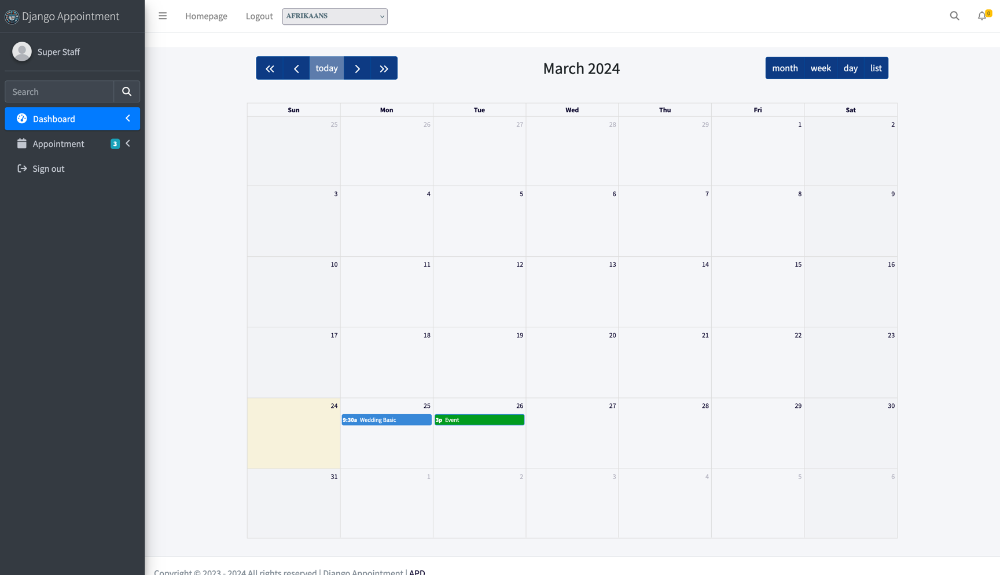
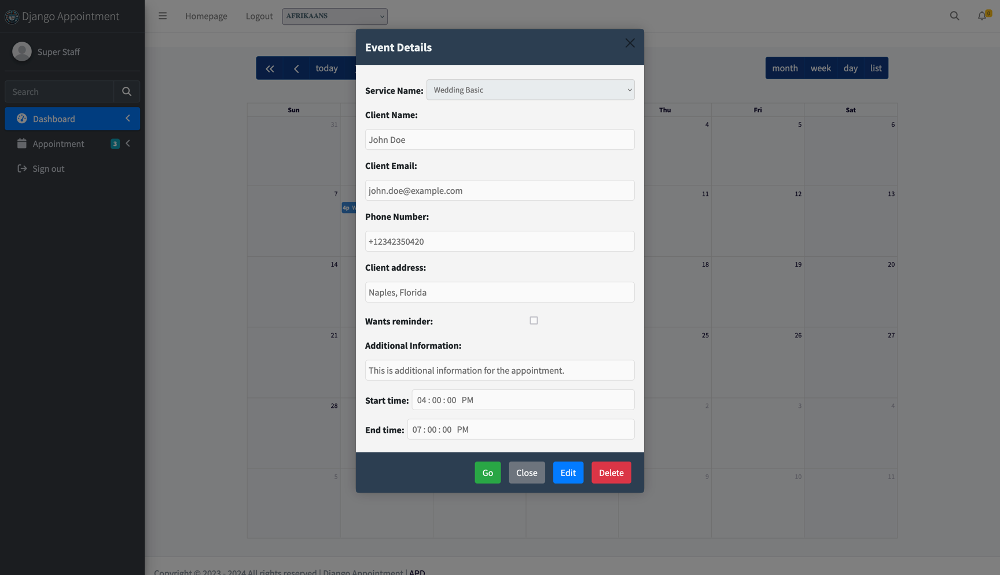
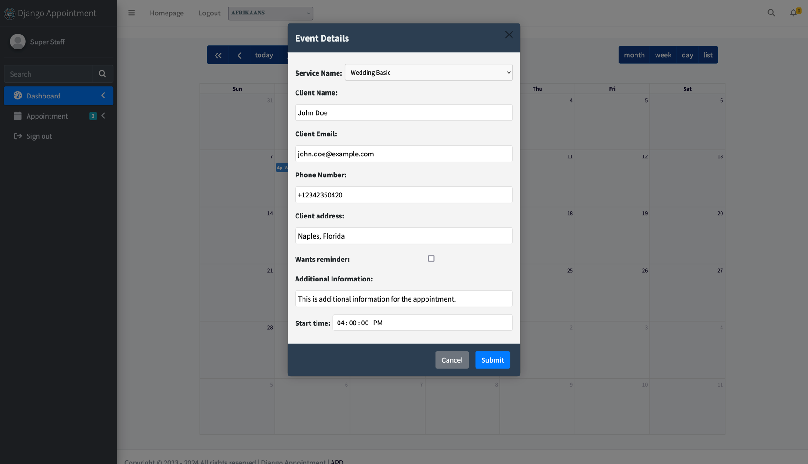
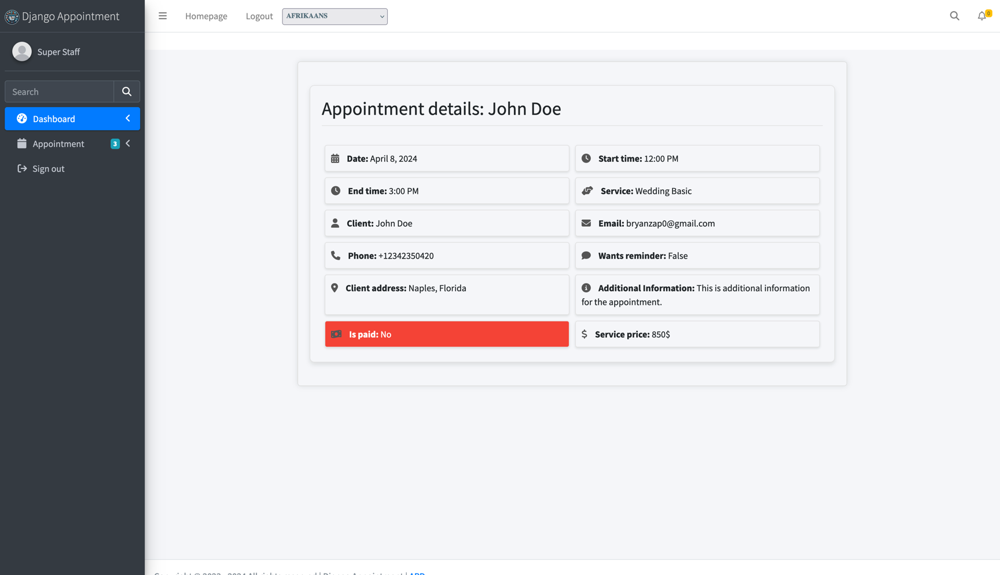
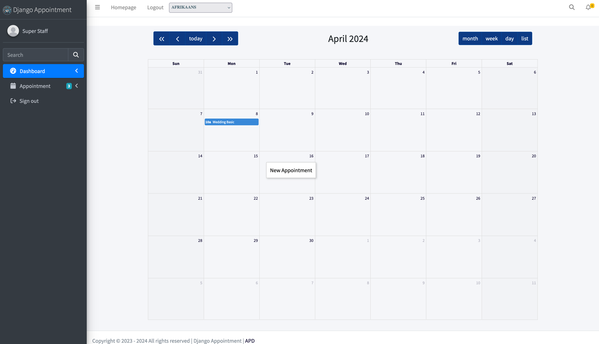
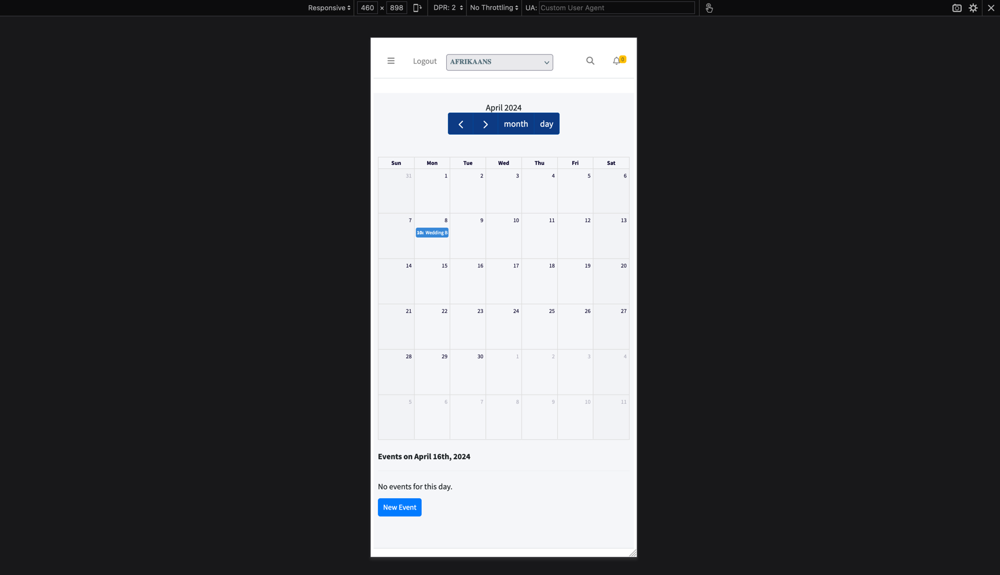
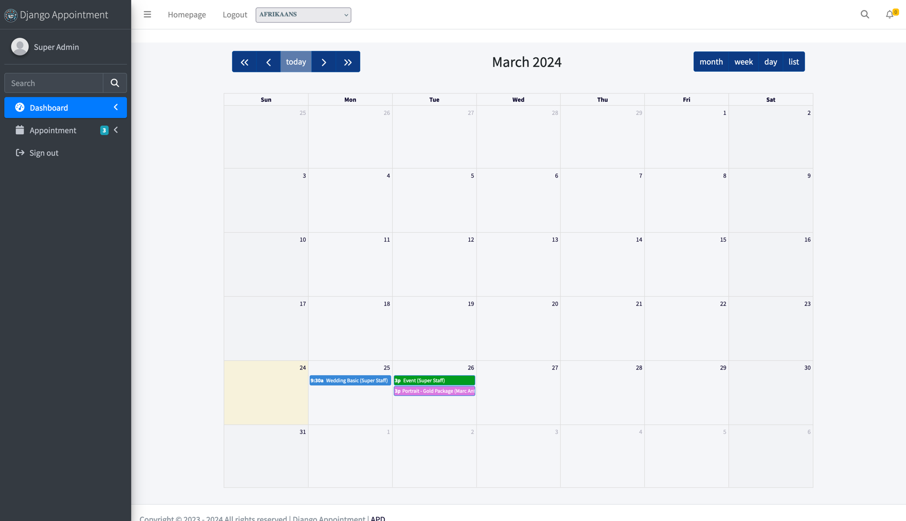
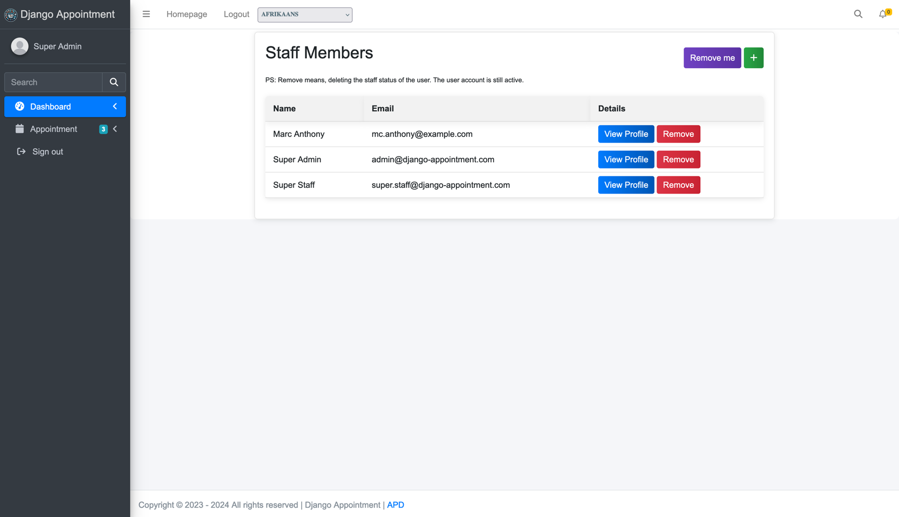

# Staff Member & Admin Features

## Staff Member Features

Staff members have access to a personalized dashboard with the following capabilities:

1. **View Appointments**: A calendar displays all appointments for the current month.
   

2. **Appointment Details**: Click on an appointment to view critical information.
   

3. **Edit Appointments**: Modify certain details of their own appointments.
   

4. **Full Appointment View**: Access all information related to an appointment.
   

5. **Delete Appointments**: Remove their own appointments with a confirmation prompt.

6. **Add New Appointments**:
   - On desktop: Right-click a day and select "New Appointment."
     
   - On mobile: Tap a day and select "New Event."
     

7. **Block Part of a Day**: Record an *unavailability* — a start and end time on a single date, with an optional
   reason — to take a lunch break, a meeting or an errand out of the bookable slots without losing the whole day.
   Days off remain the way to remove entire days.

!!! Note
    Staff members can only view and manage their own appointments, days off and unavailabilities. They cannot create
    appointments for other staff members.

## Admin Features

Administrators have full control over the appointment system, including all staff member capabilities plus:

1. **Overview Dashboard**: View all staff members and their appointments for the current month.
   

2. **Staff Management**:
   Create new staff members, modify existing staff profiles, delete staff members and view all staff details
   

3. **Service Management**:
   Add new services, modify existing services, remove services, view all service details

4. **Appointment Control**:
   View all appointments across all staff members, modify any appointment, regardless of assigned staff member, delete any appointment in the system

5. **Working Hours Management**:
   Add working hours for any staff member, modify existing working hours, remove working hours, view working hours for all staff members

6. **Days Off Management**:
   Add days off for any staff member, modify existing days off, remove days off, view days off for all staff members

7. **Unavailability Management**:
   Add unavailabilities for any staff member, modify them, remove them, and see them listed on each staff member's
   profile

8. **System Configuration**:
   Adjust global settings for the appointment system, manage payment integrations and options, set up email notifications and reminders

These comprehensive admin features allow for complete control and customization of the appointment system, ensuring it can be tailored to the specific needs of any business or organization.
