# Django Appointment System: Screenshots and Tutorial

Welcome to the Django Appointment System! This guide will walk you through setting up and using the system, complete with screenshots and a video tutorial.

## Getting Started

After completing the initial setup steps - making migrations, migrating, running the server, and creating a superuser - you might want to create an appointment as a client. However, this is not possible initially as no services or staff members are yet configured.

### Adding a Service

Your first step is to add a service. Navigate to the admin page and add a service at
`/app-admin/add-service/`, under the prefix you mounted the package on. With the
`path('appointment/', include('appointment.urls'))` used in the
[installation guide](getting-started.md#installation), that is:

```
https://mysuperwebsite.com/appointment/app-admin/add-service/
```

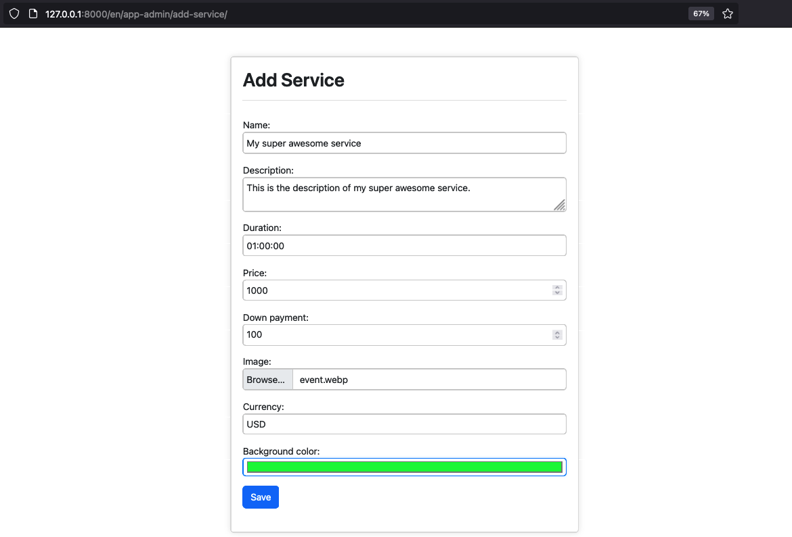

### Attempting to Create an Appointment

If you attempt to create an appointment request now, it's still not possible as there are no staff members yet:

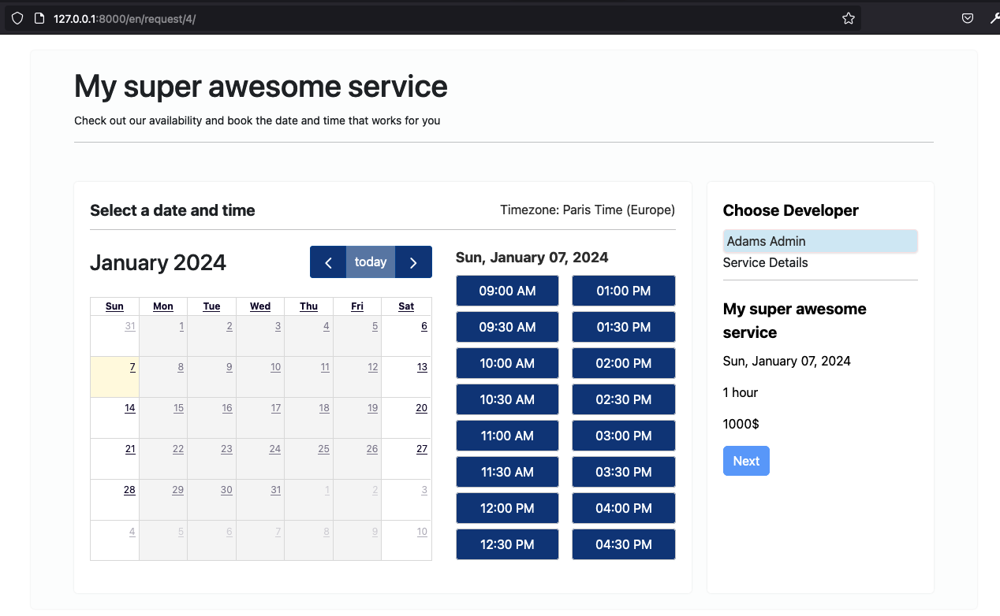

Similarly, if you check the list of appointments, it will be empty and you'll get a warning:

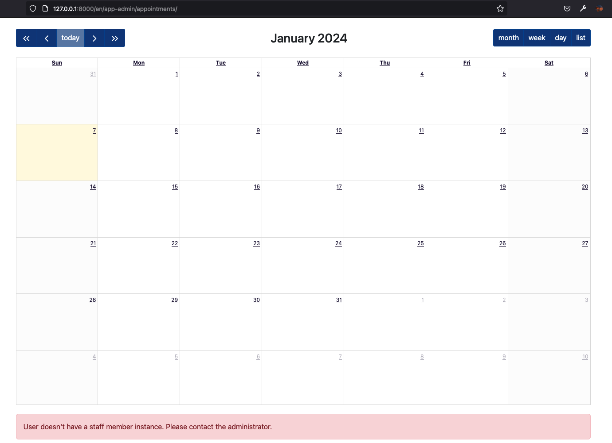

### Adding a Staff Member

To add a staff member, visit:

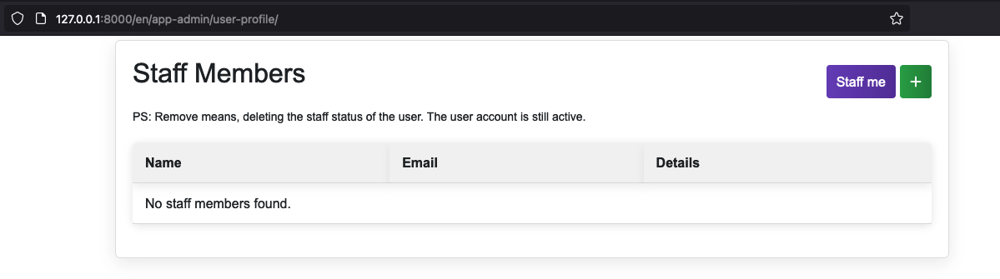

You can either add a new staff member or assign yourself as a staff member, especially if you are a superuser. In this example, I will demonstrate using the `Staff me` button.

### Updating Your Profile

Once you have created a staff member profile, you need to specify the services you offer. After doing so, your initial profile page will look something like this:

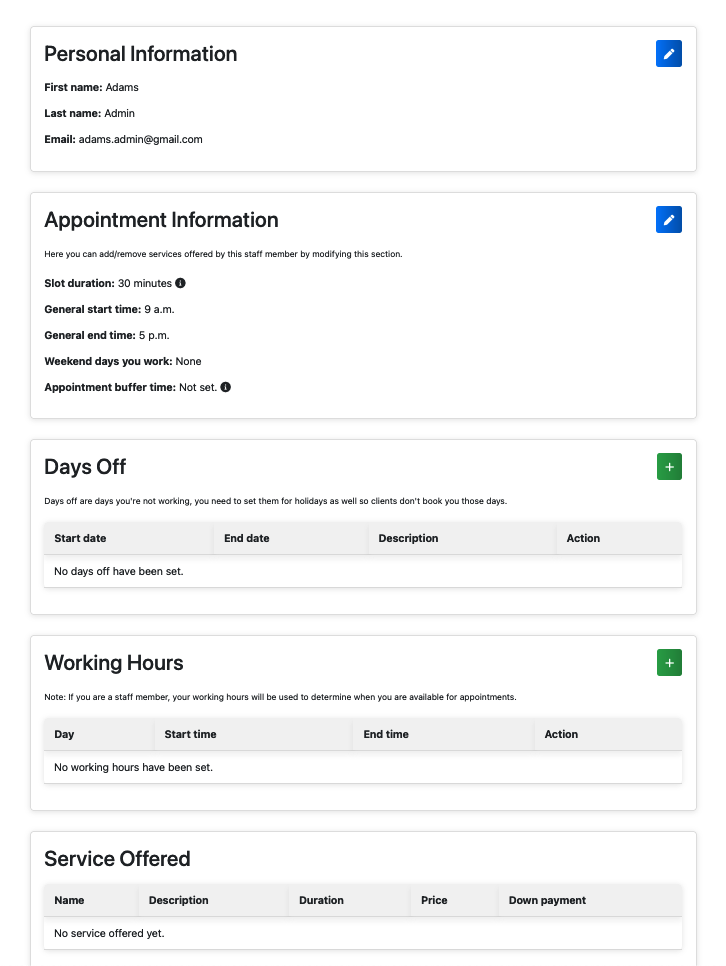

To edit your appointment information, such as the services you offer, click on the edit icon next to `Appointment Information`:

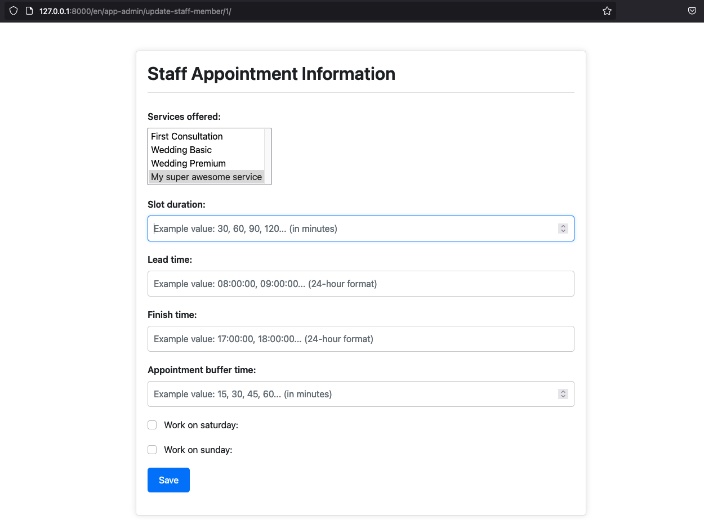

After selecting the services you offer, you may leave other fields blank if desired, and then click `Save`.

Additionally, select the days you wish to work by clicking the `add icon` next to `Working Hours`. For demonstration purposes, I have chosen Saturdays and Sundays from 9 AM to 5 PM.

Your updated profile should look like this:

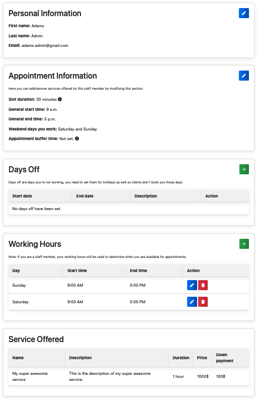

### Client's Perspective: Creating Appointments

Now, users can start creating appointments. The interface for clients would appear as follows:

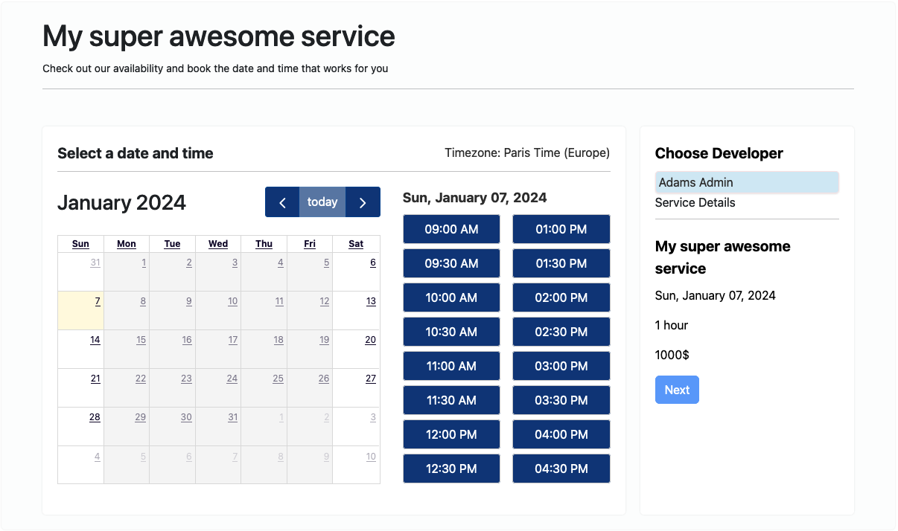

Notice that only Saturdays and Sundays are selectable, with the only staff member (you) selected by default.

Let's create an appointment request for Saturday, January 13th, 2024, at 3:00 PM:

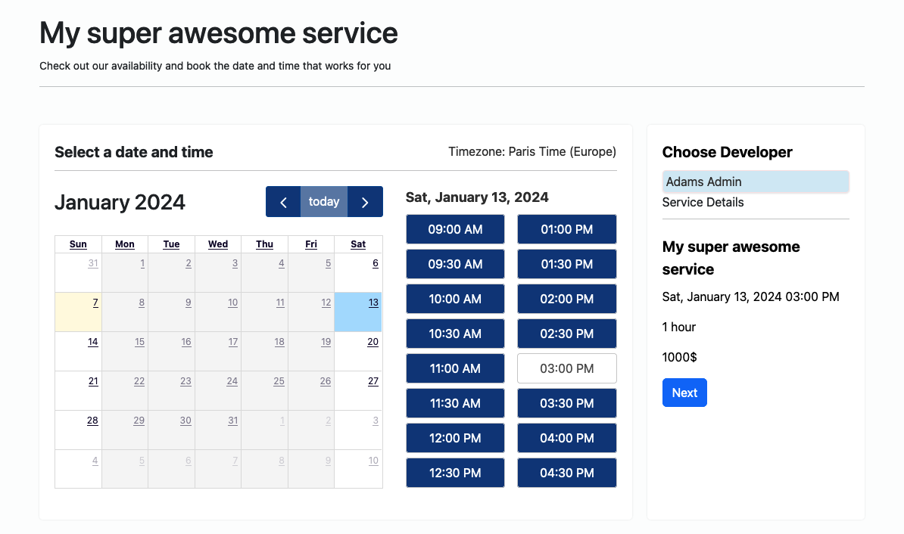

Next, add your personal information:

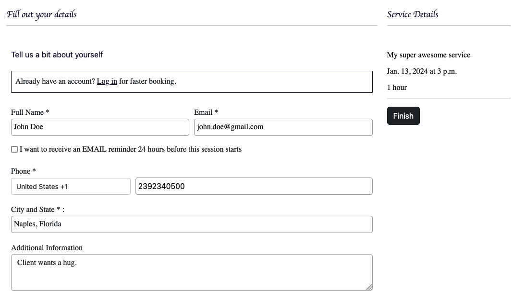

### Payment Options

If the service is paid and a payment link is set in settings, the `Pay now` button will appear. If down payments are accepted, a `Down Payment` button will also be available. Otherwise, a `Finish` button will be displayed.

Upon completion, an account is created for the user, and an email is sent with appointment and account details, provided the email settings are correctly configured.

### Managing Appointments

As an admin, you can now view the newly created appointment in your staff member appointment list:

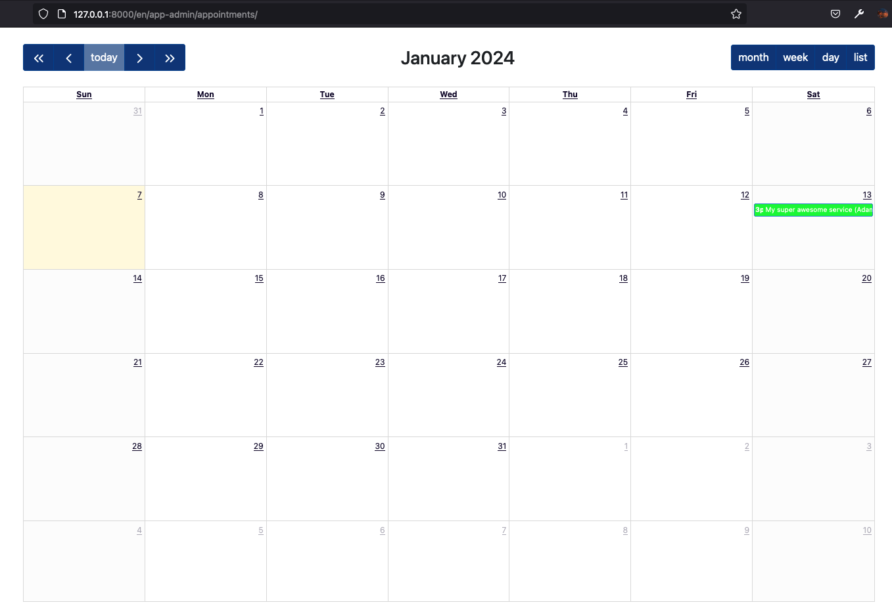

In the admin interface, you have various options to manage appointments, such as editing, adding new appointments, deleting, or rescheduling them by dragging and dropping.

### Video Tutorial

For a more comprehensive guide, including visual demonstrations of these steps, please watch the following video tutorial:

[Link to Short Video Demo](https://youtu.be/q1LSruYWKbk)
